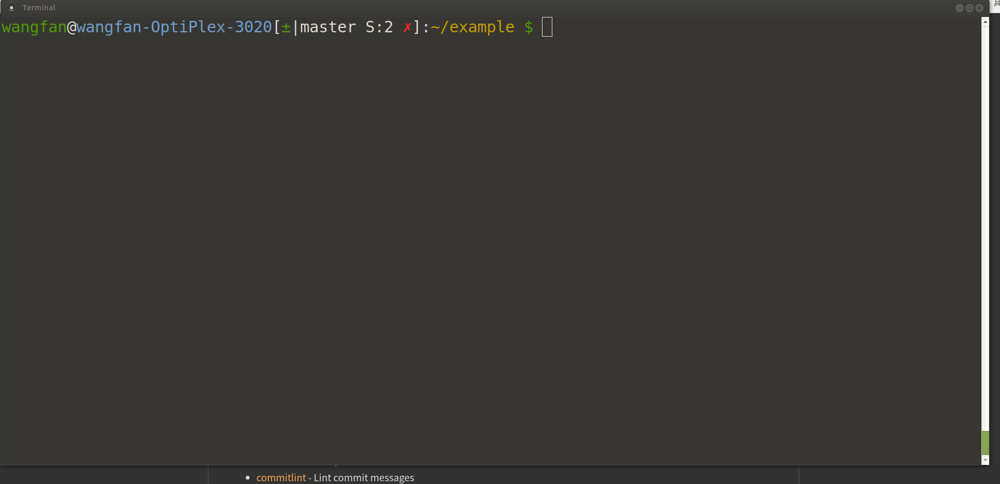
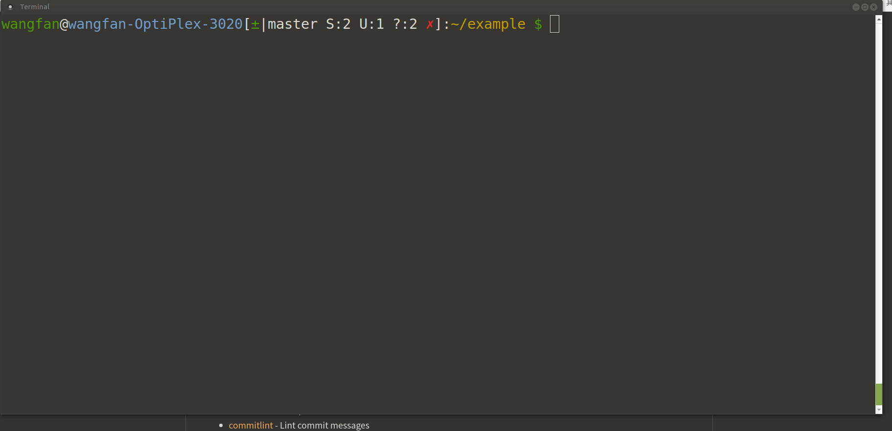
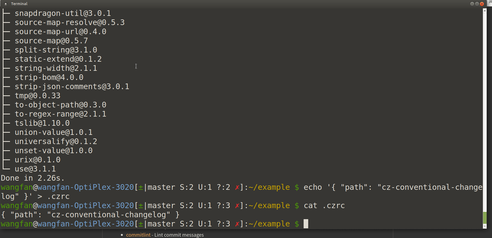
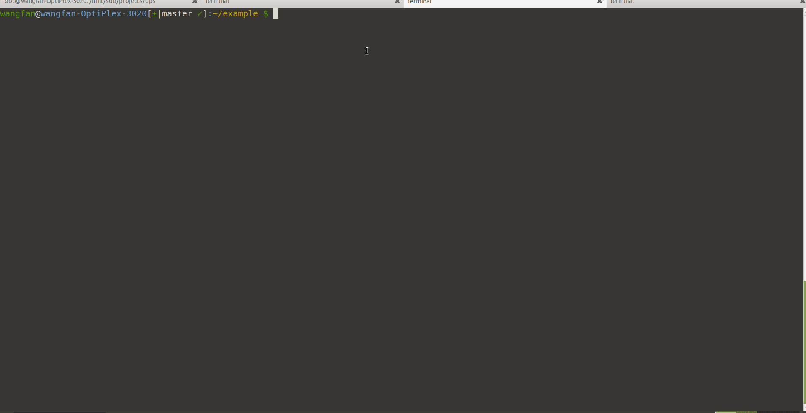

# standard-version: 以git提交为核心的发布工作流

## 关于记录程序变更日志

### Situation

* 每次发布之后都可能会想起来，好像忘了写发布日志 (︶︹︺)，呵呵，算了就这样吧 ╮(╯▽╰)╭。

* 我们需要写发布日志，这个需求可能来自领导，或是自我驱动。

  > 其实对于业务开发，大多数的变更日志是需要单独编写面向用户的文档的，本文的内容可能并不适用。
  >
  > 但对于基于npm平台发布的项目，直接将变更日志集成到项目首页的README.md文档中就十分必要了，而且这也是一个行业通用惯例。

### Task

* 项目有了更新之后，如何将更新细节归档，以供之后查询呢？

* 归档有没有格式要求？进而实现自动化生成。

### Action

由第一个问题带出的另一个问题---规范选型

```
              需要规范吗？
              ↙      ↘
          不需要       需要
          ↙              ↘
  跌入手动处理的深渊        如何写
      ↙                  ↙    ↘
game over  ←  ←  自己随便写     规范选型
```

### Result

当最终走到了最右下角的这个选项时，以下内容就是这个选项的一个相对的最佳解决方案。

目标是达到提交内容校验、版本升级、git添加tag、生成日志这几个步骤的自动化。

## 概念讲解

### 概念 I [semver](https://semver.org/lang/zh-CN/) —— 语义版本

`semver`，全称为`Semantic Versioning`，它既是一个概念，也是一个npm工具，该npm工具就是这个概念的程序实现。

我们在安装一个`npm package`之后，该`package`会自动写入项目的`package.json`文件中。

比如这样

```json
  "prettier": "^1.18.2" ①
```

左边的部分是npm包的名字，右边是版本号，一目了然。

#### 数字部分版本号解释

① 符号`^`，版本范围提示符，文档里叫[Advanced Range Syntax](https://www.npmjs.com/package/semver#advanced-range-syntax)。

该符号是使用`yarn`/`npm`安装的版本约定的默认行为。锁定从左起第一个非0的版本号，之后的版本号都可以升级。[参考](https://www.npmjs.com/package/semver#caret-ranges-123-025-004)

```text
^1.2.3 := >=1.2.3 <2.0.0
^0.2.3 := >=0.2.3 <0.3.0
^0.0.3 := >=0.0.3 <0.0.4
```

此外还有一些预发版本号，例如`alpha`、`beta`这些在首个稳定版本发布之前的试用版本号，大家可以详细阅读文档。

数字部分不能按数字来理解，其中的`.`不是数学上的小数点，只是起分割符作用。

经过`.`分割之后的三部分分别为，主版本号、次版本号、修订版本号，[参考](https://docs.npmjs.com/about-semantic-versioning)。

1. 主版本号: 当前程序经过重构，生成了与之前版本不兼容的`api`，则主版本号升级。例如angular的各个大版本，vue的1、2、3版本。

2. 次版本号: 也可以叫功能版本号，每次在没有破坏上一个版本`api`调用方法的情况下，扩展了新api或添加了其他新功能，升级的就是次版本号。

3. 修订版本号: 每次bug修正引起的升级，即升级修正版本号，修订版本号的变化既不会引起api调用的变化，也没有新的扩展功能，对于使用者来说，仅升级修订版本号是必要且安全的。

### 概念 II GIT提交格式

为了配合上面讲述的`semver`，对于`git`的提交描述就有了一系列的详细规则。

我们在使用`git commit`时，需要填写的提交内容，需要符合以下格式。

```text
  type(scope): subject
  // 空行
  body
  // 空行
  footer
```

#### 必填项: `type`、`subject`

##### type含义

* `type`是一个枚举类型，业界通用的选项如下

| 枚举值 | 含义 |
| ------ | ---- |
| build | 构建相关 |
| ci | 持续集成相关 |
| chore | 其他情况 |
| docs | 文档 |
| feat | 特性 |
| fix | bug修正 |
| perf | 性能优化 |
| refactor | 和特性修正无关的重构，例如重命名 |
| revert | 由于之前的某个错误提交，生成恢复代码的一次提交 |
| style | 编码风格相关 |
| test | 测试 |

参考 [阮一峰教程 Commit message 和 Change log 编写指南](http://www.ruanyifeng.com/blog/2016/01/commit_message_change_log.html)，其中第四、五部分内容已经过期，已有现成的成熟工具，不再需要手动处理。

* `subject`: 关于当前提交的一个最简化描述

#### 选填项: `scope`、`body`、`footer`

* scope 当前软件项目的内部分类名，没有固定选项值，按需填写，例如core、cli、rules。

* body 详细描述，根据实际需要填写即可，支持markdown格式。

推荐body写成markdown格式，在最终的`CHANGELOG.md`文件中显示的会更好看。

```
feat(cli): 添加命令行参数-p

* -p后面可以指定一个名称，例如`-p prjectA`
* -p后面可以指定多个名称，用`,`分割，例如`-p prjectA,projectB`
```

* footer，只包含两种情况:

  * 不兼容变动，例如: `BREAKING CHANGE: api方法改名.`

  * 关闭Issue，例如: `Closes #234`

## 在讲解之后概念之前，将结合一个示例工程应用上述概念

🍧 在该示例中大部分情况使用`yarn`代替`npm`。

上面讲解了 **semver版本号管理** 与 **git提交规则** 这两个概念之后，以下用一个实际工程引入一些工具演示在生产中如何使用？

### 工程示例

#### 先准备示例项目

<details><summary>初始化工程</summary>

```sh
mkdir example
cd example
yarn init -y
git init
echo node_modules > .gitignore
```


</details>

#### 将git提交按上面的提交规范起来

> 首先需要把我们的`git`提交规范起来。

> 我一直相信的一个核心思想是，人是靠不住的，必须用工具来统一约束。

> 对团队如此，对个人也是如此，人的惰性与惯性需要靠外置工具来约束或修正。

##### git提交内容校验工具: `commitlint`

* [commitlint](https://www.npmjs.com/package/commitlint) 检测每次提交的格式核心代码包。

* [commitlint-cli](https://www.npmjs.com/package/@commitlint/prompt-cli) `commitlint`的命令行扩展。

  > [commitlint配套规则参考](https://github.com/conventional-changelog/commitlint#shared-configuration)

* [@commitlint/config-conventional](https://www.npmjs.com/package/@commitlint/config-conventional) 其中一种我常用的验证规则集，之后的讲解都以该规则集为例。

  > ⚠️  注意: 不同的lint规则，可选的type可能稍有不同，以下都以conventional的规则集为规则集进行

<details><summary>安装`commitlint`系列工具，并添加配置</summary>

安装，并添加配置`commitlint.config.js`，放到项目根目录。

```sh
# 安装工具
yarn add -D commitlint @commitlint/prompt-cli @commitlint/config-conventional
# 添加配置
echo "module.exports = { extends: ['@commitlint/config-conventional'] }" > commitlint.config.js
```



安装完毕后，用命令实验，会出现规则校验失败的提示。

```bash
echo 'xxx: yyy' | npx commitlint
```


</details>

##### `commitlint`辅助工具[commitizen](https://www.npmjs.com/package/commitizen)

一个命令行下，用交互的方式生成合规的提交格式的工具，对于还不熟悉提交消息格式的人起到自动生成合规消息的作用，可有可无。

* 与`commitizen`配套的规则包`cz-conventional-changelog`。

<details><summary>安装`commitizen`与配套规则，并配置</summary>

```sh
# 安装工具
yarn add commitizen cz-conventional-changelog -D
# 添加配置
echo '{ "path": "cz-conventional-changelog" }' > .czrc
```



</details>

安装完毕之后，即可使用`git-cz`命令代替`git commit`提交。

<details><summary>运行`commitizen`</summary>

```sh
yarn git-cz
```



</details>

我们再尝试生成一次不合规的提交。

```sh
git commit -m 'xxxyyy'
```

🤔 为什么不合规的内容还是可以提交呢？

我们还需要一个把校验规则和每次的提交动作强制关联起来的环节。

### 概念III: git hooks

好比`React`或`Vue`组件的生命周期，在挂载前、后，都可以插入一些自定义行为，在`git`的这个概念上，该行为称为`git hooks`，[参考](https://www.git-scm.com/book/zh/v2/%E8%87%AA%E5%AE%9A%E4%B9%89-Git-Git-%E9%92%A9%E5%AD%90)。`git hooks`又分为 **服务端** 运行和 **本地** 运行，以下所讲的全都是 **本地** 运行`hooks`。

### `githook`工具介绍

将`commitlint`绑定到`git`的`commit-msg`提交钩子上，在每次生成提交前调用`commitlint`检测提交文字格式，不通过验证则无法生成提交。

* [yorkie](https://www.npmjs.com/package/yorkie)


安装yorkie:

```sh
yarn add yorkie
```

在package.json文件中添加提交消息验证

yorkie配置，在package.json中

```javascript
"gitHooks": {
  "commit-msg": "npx commitlint -E GIT_PARAMS"
}
```

* [husky](https://www.npmjs.org/package/husky)


安装:

```sh
yarn add husky
```

husky配置，在package.json中

```javascript
"husky": {
  "hooks": {
    "commit-msg": "npx commitlint -E HUSKY_GIT_PARAMS"
  }
},
```

两个工具都不错，我个人感觉`husky`的错误提示信息可能更好一些。

🐾 必须先将项目纳入`git`管理，再安装`husky/yorkie`，否则不会安装`git hooks`。

而且`husky`安装时，如果当前目录没有建立`git`环境，安装时会有报错提示，如下所示:

```
husky > Setting up git hooks
fatal: 不是一个 git 仓库（或者直至挂载点 /mnt 的任何父目录）
停止在文件系统边界（未设置 GIT_DISCOVERY_ACROSS_FILESYSTEM）。
husky > Failed to install
```

<details><summary>关于`githooks`的补充说明</summary>

git hooks分为服务器hook和本地hook，此处讲的全部都是本地hook。

详细的hooks说明需要看官方文档，想不起来的时候，可以快速看一下当前项目里的`.git/hooks`文件夹，里面的文件就是当前本地git支持的hook，这些文件都是见名知意的。


我们还可以在其他的`git`生命周期中注入`hooks`，例如`pre-commit/pre-push`自动运行测试等，测试不通过则阻止提交/推送。

</details>

### 概念IV: CHANGELOG

经过了之前这么多铺垫，终于回到最初变更日志这个目标上了。

为git提交内容添加各种校验，其目的就是为了生成可以具有固定规则从而可以被提取的日志记录，生成当前发布版本的`CHANGELOG.md`。

* 工具[conventional-changelog-cli](https://www.npmjs.com/package/conventional-changelog-cli)

  相似的规则集可见[conventional-changelog packages](https://github.com/conventional-changelog/conventional-changelog/tree/master/packages)
以下都以`conventionalcommits`为默认规则集合

安装:

```sh
yarn add conventional-changelog-cli conventional-changelog-conventionalcommits -D
```

生成日志:

```sh
npx conventional-changelog -p conventional -i CHANGELOG.md -s -r 0
```

conventional-changelog有很多可调整的参数，具体参考[conventional-changelog文档](https://www.npmjs.com/package/conventional-changelog-cli)即可。

执行之后，会自动生成更新日志`CHANGELOG.md`文件。

🐾 每次需要变更版本号发布之前，才需要生成changelog，不需要每次修改或提交都生成。

### 合战: 集成

#### 工具: standard-version

除发布之外的全自动化工具

<details><summary>运行`standard-version`</summary>

安装:

```bash
yarn add standard-version
```

执行:

```bash
npx standard-version
```



</details>

其运行流程如下：

```sh
收集上一次打tag的version到当前为止是否有feat和fix或BREAKING CHANGE
                  ↓
if 有BREAKING CHANGE，则自动升级major版本号
                  ↓
else if 有任何一个feat，则自动升级minor版本号
                  ↓
else if 有feat，有fix，则自动升级patch版本号
                  ↓
            生成新版本号
                  ↓
将新版本号写入`package.json`
                  ↓
自动生成一个内容为`chore(release): x.x.x`的提交
                  ↓
      将最新的提交上添加版本`git tag`，与`pakcage.json`中的一致
                  ↓
根据收集的提交记录汇总，生成最新`CHANGELOG.md`
```

🐾 无论是公网npm平台还是内部npm平台，只要发布版本就无法被覆盖，但可以撤销。

可以使用`npm publish --dry-run`模拟发布流程，自动调用`prepublishOnly`来。

🐾 此处使用`npm publish` 而没有用`yarn publish` 因为`yarn publish`会有命令行交互，提示让用户输入新版本号，打断了自动流程。

#### 🐾 `1.0.0`之前与之后的两种策略

* Before 🚲: 所有小于`1.0.0`的版本都视为非正式版本，比如`alpha`或`beta`版。即使有`BREAKING CHANGE`也不会升主版本号(因为软件还没有发布，也不会有什么破坏兼容问题)。所有`feat`都不会升`minor`版本号，只会升级`patch`版本号。

* After 🛺: 按正式规则办事，按提交日志关键字升级。如果上次与本次发布之间没有可以升级的`git tag`，则会自动将`patch`版本号升级。

#### 集成到npm发布流

在`package.json`中添加发布`hook`

通常在`prepublishOnly`中添加，再打包编译，然后自动升级版本的发布流程。

```json
{
  "scripts": {
    "release": "standard-version",
    "prepublishOnly": "yarn test && yarn build && yarn release" ② ③
  }
}
```

② 不要用`prepublish`，`prepublish`在每次`yarn add`新依赖时也执行。

③ 将`standard-version`的执行放到测试与编译等步骤之后，否则如果先生成了版本号，但测试或编译失败了，需要手动git回滚，删除CHANGELOG内容，去掉`git tag`等一系列错误。

## 总结: 以上所有工具之间的关系


用更简单一些的图来表示关系

### ㊧:最简化执行的流程 ———— ㊨: 添加的调用关系的详细流程
```
               ㊧                               ㊨
                                           before git提交
                                          自动调用git hook
                                           commintlint校验
                                                 ↓
            git提交                           git提交
               ↓                      ↙          ↓            ↘
               ↓                     ↓   before (npm publish)  ↓
               ↓                     ↓ 自动调用standard-version  ↓
               ↓                     ↓           ↓              ↓
               ↓                     ↓      自动提升版本          ↓
               ↓                     ↓   将新版本添加git tag      ↓
               ↓                      ↘   生成CHANGELOG.md     ↙
               ↓                                 ↓ 
               ↓                                 ↓ 
               ↓                                 ↓ 
          npm publish                         npm publish
```

### 最简化执行步骤:

#### ㊀创建项目，添加git与npm环境。

```sh
# 创建项目
mkdir yourapp && cd yourapp
yarn init -y
git init
echo 'node_modules' > .gitignore
```


#### ㊁安装工具

```sh
# 安装工具
yarn add commitlint @commitlint/prompt-cli @commitlint/config-conventional husky standard-version
```


#### ㊂添加`commitlint`规则配置文件

```sh
echo "module.exports = { extends: ['@commitlint/config-conventional'] }" > commitlint.config.js
```


#### ㊃增加配置到`package.json`

```
{
  "scripts": {
    "release": "standard-version",
    "prepublishOnly": "yarn release"
  },
  "husky": {
    "hooks": {
      "commit-msg": "npx commitlint -E HUSKY_GIT_PARAMS"
    }
  }
}

```


#### ㊄执行测试一下查看结果

```sh
npm publish --dry-run
# 查看结果
cat CHANGELOG.md
git tag
```

最后添加一些细节，就完成了🍻！


